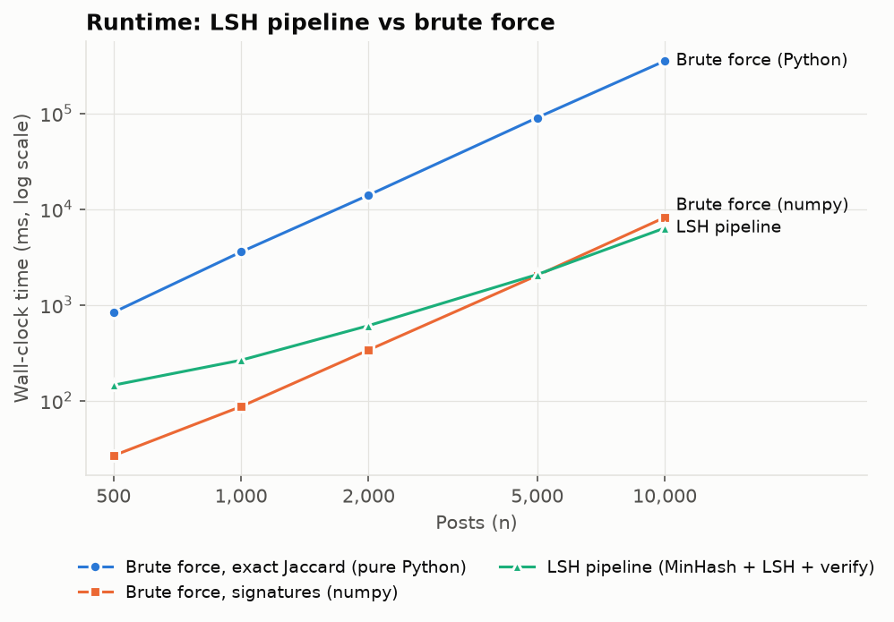
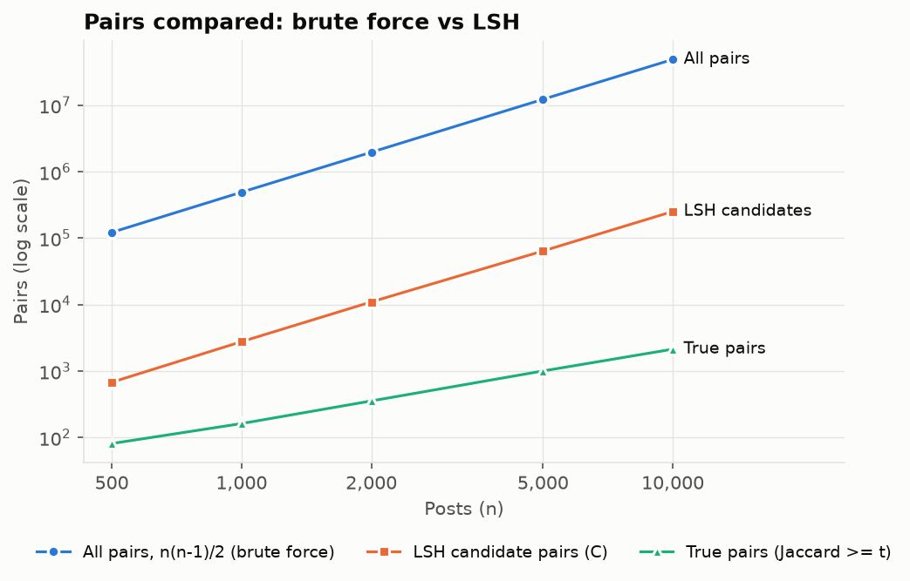
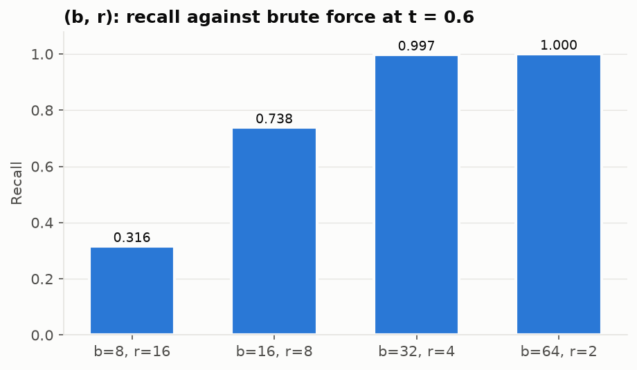
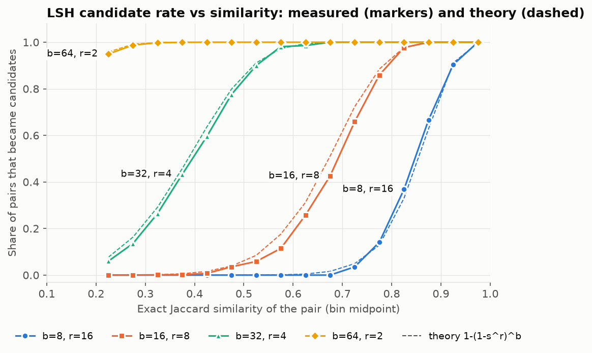
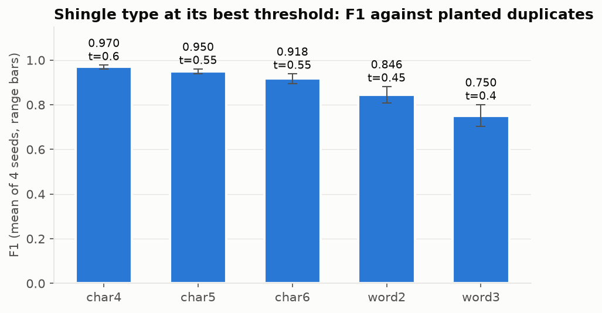
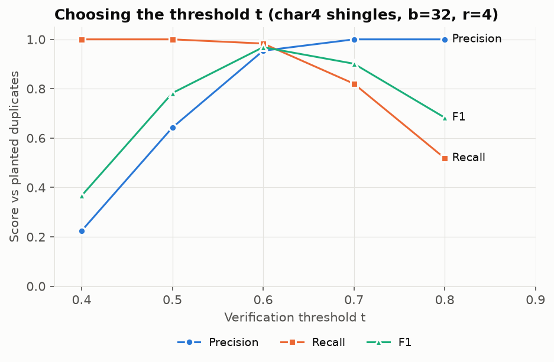

# Module 1 results: near-duplicate detection

Measured results for the evaluation plan in Section 2.1.1 of the project plan. Every number and figure here was produced by one command:

```bash
cd engine
python benchmarks/report.py
```

The script reruns everything and overwrites this folder's CSVs and figures. The text of this page was written from the run of 2026-10-05.

**Data.** All results use synthetic posts from `engine/benchmarks/synthetic.py`, because no real export was available yet.
- Original captions are composed from category-specific sentence patterns (food, travel, fitness, fashion, small business, personal).
- About 15% of posts are edited copies of earlier posts. The edits are word deletions, insertions, swaps, replacements and typos, plus cosmetic changes (case, emoji, hashtags, mentions, links). Edit rates are drawn between 0 and 30% of the words.
- The planted (original, copy) pairs are the labels.

Conclusions about real captions should be rechecked once real data exists (`--base-captions`).

**Machine.** Intel Xeon @ 2.10 GHz, 4 cores, Python 3.11.15, numpy 2.4.6.
- Timings come from `scaling.csv` only, which runs alone on the machine.
- The other experiments run in parallel and are used for accuracy only.
- Each timing is from a single run.

**Final configuration** (defaults in `DuplicateAnalyzer`): character 4-grams, 128 MinHash functions, b = 32 bands × r = 4 rows, verification threshold t = 0.6 with exact Jaccard, seed 42.

## 1. Scaling: LSH vs brute force

| n | Pairs n(n−1)/2 | LSH candidates C | C / all pairs | LSH pipeline | Brute force, exact (pure Python) | Brute force, signatures (numpy) | Recall vs brute force |
|---:|---:|---:|---:|---:|---:|---:|---:|
| 500 | 122,265 | 678 | 0.55% | 0.14 s | 0.83 s | 0.03 s | 1.000 |
| 1,000 | 492,528 | 2,767 | 0.56% | 0.26 s | 3.6 s | 0.09 s | 0.994 |
| 2,000 | 1,969,120 | 10,983 | 0.56% | 0.61 s | 14.0 s | 0.34 s | 0.997 |
| 5,000 | 12,308,241 | 64,159 | 0.52% | 2.07 s | 90.1 s | 2.03 s | 0.999 |
| 10,000 | 49,089,186 | 252,338 | 0.51% | 6.34 s | 352.6 s | 8.18 s | 0.998 |

The LSH pipeline time includes MinHash signatures, banding and exact verification of the candidates. Preprocessing and shingling are the same for every method and are not included.





What this shows:

- **Against brute force with the same exact Jaccard check, LSH is 6× faster at 500 posts and 56× faster at 10,000.** It still finds 99.8% or more of the pairs brute force finds at every size.
- **Against a numpy brute force over signatures, LSH only breaks even at about 5,000 posts.** They tie at 5,000 (2.07 s vs 2.03 s), and LSH is 1.3× faster at 10,000. Below that, vectorized all-pairs comparison is faster, because LSH has a fixed cost per post (signatures, Python dictionaries for the bands). This is the crossover the plan asked us to report honestly.
- **C grows roughly with n² on this data, not linearly.** LSH checks a steady 0.5% of all pairs. From 2,000 to 10,000 posts, n grows 5× and C grows 23×.
  - The cause is captions in the same category sharing vocabulary. That creates many pairs with similarity 0.3–0.45, and b = 32, r = 4 still makes those candidates 26–60% of the time (Section 3).
  - So on this data LSH gives a large constant-factor saving (about 200× fewer pairs), not a change in growth rate. This is the "expected-case" caveat in the plan's complexity section.
  - Verification of those candidates is 59% of the LSH time at 10,000 posts.

## 2. Choosing (b, r)

n = 2,000, character 4-grams, t = 0.6, 128 hash functions. Recall is measured against brute force.

| b × r | Steep point (1/b)^(1/r) | Candidates C | Recall vs brute force | F1 vs planted pairs |
|---|---:|---:|---:|---:|
| 8 × 16 | 0.878 | 112 | 0.316 | 0.585 |
| 16 × 8 | 0.707 | 316 | 0.738 | 0.884 |
| **32 × 4** | **0.420** | **10,983** | **0.997** | **0.968** |
| 64 × 2 | 0.125 | 365,584 | 1.000 | 0.967 |



- **32 × 4 is the only setting with near-full recall that still skips 99.4% of pairs.**
- **16 × 8 is 35× cheaper but misses a quarter of the true pairs.** Its steep point (0.71) sits above t = 0.6.
- **64 × 2 recovers the remaining 0.3% but turns 19% of all pairs into candidates.** That defeats the purpose.

## 3. The S-curve: measured vs theory

For the 133,582 pairs with exact Jaccard ≥ 0.2 among 3,000 posts, the chart below shows the share that became LSH candidates in each similarity range. The dashed lines are the theoretical P(candidate) = 1 − (1 − s^r)^b, averaged over the pairs in each range.



- **The measured curves follow theory for all four settings.** The largest gap in any range with at least 30 pairs is 0.085 (16 × 8, similarity 0.65–0.70); for 32 × 4 it is 0.041.
- **For 16 × 8 and 32 × 4, measured rates sit slightly below theory at mid similarities, consistently.** A likely cause is that the (a·x + b) mod p hash family is only approximately min-wise independent. The effect is small next to the gap between settings.

## 4. Shingle type and threshold

The plan chooses the shingle type by measured F1 against labeled pairs. Each shingle type was run at thresholds 0.40–0.65 on 4 seeds (n = 2,000, 32 × 4). The chart shows each type at the threshold with its best mean F1.

| Shingles | Best t | Mean F1 (4 seeds) | Range |
|---|---:|---:|---|
| **char 4** | **0.60** | **0.970** | 0.961–0.978 |
| char 5 | 0.55 | 0.950 | 0.938–0.961 |
| char 6 | 0.55 | 0.918 | 0.895–0.939 |
| word 2 | 0.45 | 0.846 | 0.809–0.882 |
| word 3 | 0.40 | 0.750 | 0.703–0.802 |



**Decision: character 4-grams at t = 0.6.** The plan started at 5-grams.
- Character 4-grams win on every seed.
- Word shingles do worst because a single typo or swapped word breaks several word n-grams at once, while it only affects a few character n-grams.
- Caveat: the planted edits include character typos, which favor character shingles. Real captions may narrow the gap.

Threshold sweep for character 4-grams (seed 42), F1 against planted pairs:

| t | Precision | Recall | F1 |
|---:|---:|---:|---:|
| 0.4 | 0.224 | 1.000 | 0.367 |
| 0.5 | 0.643 | 1.000 | 0.783 |
| **0.6** | **0.954** | **0.983** | **0.968** |
| 0.7 | 1.000 | 0.820 | 0.901 |
| 0.8 | 1.000 | 0.519 | 0.683 |



## 5. Precision against planted pairs falls as n grows

In the scaling run, precision against planted pairs drops from 1.000 at 500 posts to 0.818 at 10,000. Recall stays between 0.975 and 0.986.
- Precision against brute force stays 1.0 throughout, so every extra pair really does have similarity ≥ 0.6. Those pairs simply weren't planted.
- They are independently written captions that happen to share most of their wording. Their number grows with n², while planted pairs grow with n.
- On real data these are exactly the "unintentionally repetitive" posts ContentIQ is meant to find. On synthetic data they read as false positives.

## 6. Fast verification mode

Verifying candidates with the MinHash estimate instead of exact Jaccard (n = 2,000, t = 0.6) trades a little accuracy:

| Verify | Precision vs brute force | Recall vs brute force | F1 vs planted pairs |
|---|---:|---:|---:|
| exact Jaccard | 1.000 | 0.997 | 0.968 |
| MinHash estimate | 0.961 | 0.958 | 0.962 |

With 128 hash functions the estimate has a standard error of about 0.04 near t = 0.6, so pairs close to the threshold land on the wrong side about as often in either direction. Exact verification stays the default; fast mode exists for larger n, where verification dominates the runtime (Section 1).

## 7. 32-bit shingle IDs

Shingles are hashed to 32-bit IDs (BLAKE2b, 4 bytes). Across all shingles of 1,985 posts there were no collisions: no two different shingles shared an ID. Jaccard on the IDs equals Jaccard on the original strings for every candidate pair (largest difference 0.0). See `collisions.csv`.

## Files

| File | Contents |
|---|---|
| `scaling.csv` | Section 1; `benchmark.json` is the same data in the `GET /api/benchmark` shape |
| `sweep_br.csv` | Section 2 |
| `lsh_curve.csv` | Section 3 |
| `sweep_shingle.csv`, `sweep_threshold.csv` | Section 4 (every shingle × threshold × seed) |
| `verify_fast.csv` | Section 6 |
| `collisions.csv` | Section 7 |
